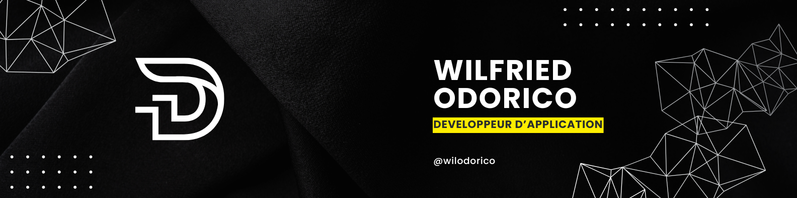

# 👋 Hello, je suis Wilfried Odorico !

🎯 **Développeur Fullstack passionné** par la création de solutions numériques modernes et performantes. Expert en **Python**, **Django**, et **JavaScript**, je m'efforce d'allier performance, accessibilité, et design dans mes projets.

📍 Basé en Nouvelle-Aquitaine, France | 🌍 Toujours prêt à relever de nouveaux défis technologiques !

---

## 🌟 **À propos de moi**

Depuis 2019, je construis des projets complets et impactants en m'appuyant sur des technologies robustes. Mon parcours de reconversion m'a permis d'acquérir des compétences variées, allant du développement backend sécurisé au design frontend élégant.

---

## 🔧 **Compétences techniques**

- **Langages** :       
- **Frameworks & Outils** : React.js, Node.js, TinyDB, Sass, API REST.  
- **Autres compétences** : SEO, Responsive Design, Tests unitaires avec Pytest et Jest.  

---

## 🤝 **Soft Skills**

- **Adaptabilité** : Apprends rapidement et m’adapte à des environnements variés.  
- **Rigueur** : Porte une attention particulière aux détails et à la qualité du code.  
- **Empathie** : Comprends les besoins des utilisateurs et des collaborateurs pour mieux répondre à leurs attentes.  
- **Esprit d'équipe** : Participe activement à aider mes collègues et à échanger des idées constructives.

---

## 📜 **Bonnes pratiques de codage**

✨ Je suis engagé à produire un code clair, maintenable et performant grâce aux principes suivants :  
- **Clean Code** : Structuration logique, nommage explicite, et réduction de la complexité.  
- **PEP8** : Respect des normes de style en Python pour garantir la lisibilité du code.  
- **Documentation** : Utilisation de docstrings et de commentaires clairs.  
- **Tests** : Adoption de tests unitaires pour fiabiliser mes développements.  

---

## 📘 **Formations en cours & sujets qui m’intéressent**

Je m’investis activement dans l’apprentissage continu pour renforcer mes compétences et explorer de nouveaux domaines :  
- **Clean Architecture** : Structurer des applications robustes et évolutives.  
- **Principes SOLID** : Concevoir un code orienté objets flexible et maintenable.  
- **Test-Driven Development (TDD)** : Développer des fonctionnalités guidées par les tests.  
- **Conception d'API** : Approfondir la sécurité et les performances des services REST.

---

## 🌟 **Projets phares**

| Nom du projet        | Description                                                                                       | Technologies                   |
|----------------------|---------------------------------------------------------------------------------------------------|--------------------------------|
| 🎮 **Centre Échecs** | Application pour organiser des tournois d'échecs avec un système suisse et persistance JSON       | Python, TinyDB                |
| 🎬 **Films Stars**   | Site des meilleurs films basé sur une API publique                                                | JavaScript, HTML, CSS         |
| 💼 **Réseau social** | Solution fullstack avec authentification JWT et gestion des données                               | Node.js, React.js, Sequelize  |

🛠️ **Découvrez plus de projets sur [mon GitHub](https://github.com/wilodorico)** !

---

## 📈 **Statistiques GitHub**

---

## 📫 **Contactez-moi**

🌐 **Portfolio** : [wilodorico.fr](https://www.wilodorico.fr/)  
💼 **LinkedIn** : [Wilfried Odorico](https://www.linkedin.com/in/wilfried-odorico)  
📧 **Email** : [wilfried.odorico@gmail.com](mailto:wilfried.odorico@gmail.com)  

---

✨ *"Toujours prêt à apprendre et à relever de nouveaux défis dans le développement web et logiciel."*

